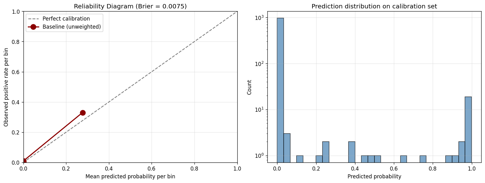
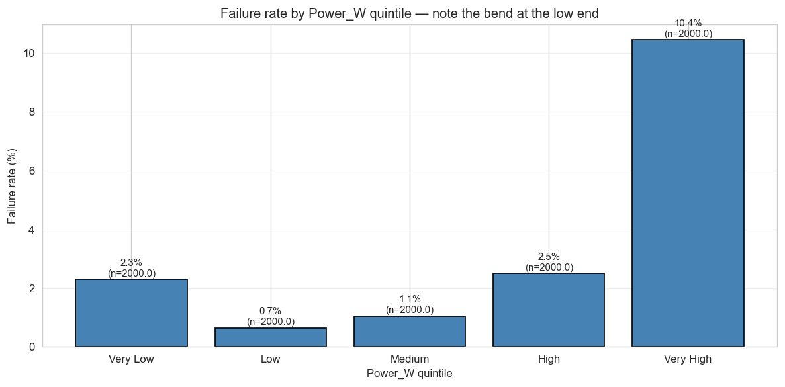
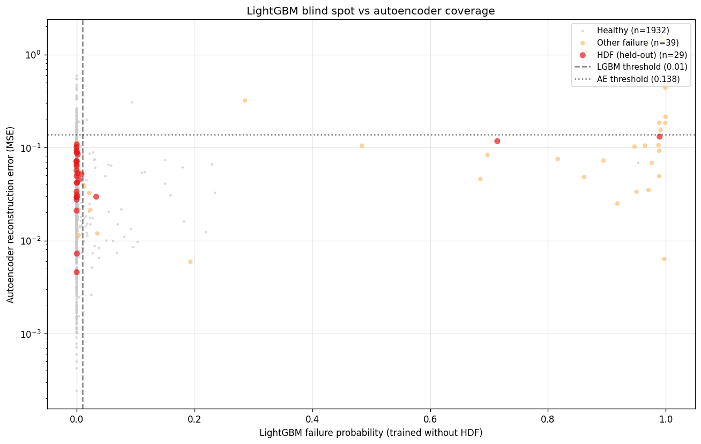

# Predictive Maintenance with Cost-Aware Operating Point

A predictive maintenance system for industrial equipment built on the UCI AI4I 2020 dataset. The work combines a calibrated LightGBM classifier with an autoencoder for novel-anomaly detection, and calibrates its operating threshold around the cost asymmetry between missed failures and false alarms rather than around F1 score.

The intent isn't to claim production-ready performance — the dataset is synthetic and the cost figures are synthesised from public sources rather than from a specific deployment. The intent is to show how an engineer with operational experience thinks about deploying machine learning in industrial settings: which assumptions to question, which methodology choices to diagnose before applying, and which trade-offs to surface for the people who'll actually use the model.

## The core design decision

Most published predictive maintenance work reports F1 or AUC, both of which weight precision and recall equally. In an industrial setting that weighting is rarely correct. The cost of a missed failure — unplanned downtime, secondary damage, lost production — is typically an order of magnitude or two larger than the cost of an unnecessary inspection.

The published data on unplanned downtime supports this. Siemens' *True Cost of Downtime 2024* report puts annual losses for Fortune Global 500 manufacturers at roughly US\$1.4 trillion, with automotive lines costing up to \$2.3 million per hour and heavy industry reaching \$59 million per hour. ABB's *Value of Reliability Survey 2023* gives a median across industrial sectors of around \$125,000 per hour. Deloitte's 2022 *Predictive Maintenance and the Smart Factory* report estimates industrial manufacturers lose \$50 billion annually to unplanned downtime, with reactive emergency repairs costing 3 to 5 times the equivalent planned work.

For false-alarm costs, no per-event figure exists in the published literature — the cost is too deployment-specific to publish a meaningful single number. The cost analysis notebook synthesises a representative figure from BLS wage data (industrial machinery mechanic median wage, May 2024) and the Siemens hourly production-interruption rates, with the synthesis steps documented and a sensitivity range shown.

The resulting cost ratio sits in the 10:1 to 20:1 range, which is consistent with industry rules of thumb. Under this asymmetry, optimising for F1 is the wrong objective. The threshold should be tuned to favour recall — accepting more false alarms in exchange for catching more genuine failures.

## Methodology: diagnose before calibrating

The first version of this project used `scale_pos_weight=28` to handle the 28:1 class imbalance, then picked a decision threshold of 0.33 from visual inspection of the precision-recall curve. Both choices were directionally reasonable but quantitatively incomplete.

The rebuild takes a different approach. Train an unweighted baseline first, with no class re-weighting. Plot the reliability diagram on a held-out set, and examine the shape of any miscalibration before choosing a calibration technique. Then decide whether calibration is needed at all.

In this case, the diagnostic-first approach revealed something useful: the unweighted baseline was already well-calibrated by construction. Brier score on the test set was approximately 0.008, AUC across five-fold cross-validation was 0.978 with tight variance, and the reliability diagram showed predictions tracking the diagonal closely. Applying Platt scaling as a sanity check slightly worsened the Brier score, consistent with Niculescu-Mizil & Caruana's 2005 finding that calibration methods can degrade an already-calibrated base model. The decision was to ship the baseline without post-hoc calibration.



*Reliability diagram for the unweighted baseline. Predictions cluster bimodally near 0 and 1, with the visible bins tracking the diagonal. This is the diagnosis that justified shipping without post-hoc calibration.*

The cost-optimal threshold derivation followed from there. The Bayes-theoretical optimum under the central-case cost ratio is approximately 0.06. An empirical sweep across the test set landed the cost minimum at 0.01 — substantially below the theoretical value. The gap reflects the model's slight under-prediction in the low-probability tail; within the flat region of the cost curve, the empirical minimum captures more genuine failures at low marginal false-alarm cost. The deployed threshold is the empirical 0.01.

## What the EDA revealed

The exploratory analysis surfaced one finding that materially changed the diagnostic translator design. Failure rate against Power_W isn't monotonic. It's U-shaped: elevated at both the high end (expected, more stress) and the low end (unexpected).



*Failure rate by Power_W quintile. The low-power tail is not noise — drilling into those rows shows they're characterised by low rotational speed and high torque, the classical stall-zone signature.*

Drilling into the low-power-high-failure rows showed they share a specific signature: low rotational speed and high torque. This is the stall zone — heavy cutting load at near-stall RPM, where mechanical stress is high but motor self-cooling is poor. The same total power as a benign light-load condition, but a completely different mechanical regime.

This matters operationally because the recommended action differs. For high-power overstrain, the response is to reduce load and inspect bearings. For stall-zone operation, the first move should be to review cutting parameters — an aggressive feed rate can produce this signature even on healthy hardware. Investigating the spindle drive should follow only if the parameters are within spec. The diagnostic translator has separate patterns for these two cases precisely because the EDA showed they need separate responses.

## Feature engineering

The feature set augments the five raw sensor readings (air temperature, process temperature, rotational speed, torque, tool wear) with four engineered features grounded in mechanical engineering.

**Temp_Delta** is the difference between process and air temperature. It encodes the temperature gradient that drives heat transfer; a narrowing gradient under constant load indicates cooling degradation.

**Power_W** is torque times rotational speed times 2π/60 — the actual mechanical power in watts. Two operating points with the same Power_W produce comparable mechanical load regardless of how their individual torque and RPM values combine.

**Energy_Per_Wear** is Power_W divided by (Tool_Wear + 1). As tools dull, they need more power per unit of accumulated work; this ratio rises and provides an indirect measure of tool condition. Trees can't approximate ratios at split nodes, which makes this a non-redundant engineered feature rather than a transformation the model could learn on its own.

**Tool_Wear_Risk_Zone** is a boolean encoding the manufacturer-specified end-of-life threshold (180 minutes, a placeholder requiring real-deployment calibration). Tool life follows Taylor's equation, with a sharp cliff near end-of-life; a boolean captures this structure better than the continuous variable alone.

Product type is one-hot encoded (Type_L, Type_M, Type_H) rather than treated as ordinal. The ordinal encoding from the previous iteration assumed equal distances between L-to-M and M-to-H, which isn't supported by the data.

The earlier `Risk_Heuristic` feature (Power_W × Temp_Delta) was removed. Pre-computed products of existing features create multicollinearity for tree models without adding new information — trees learn interactions natively through split structure. Removing it sharpened SHAP attributions on the underlying features without changing model predictions meaningfully.

## Operator-facing explainability

SHAP values tell an engineer which features pushed a prediction toward "failure" or "healthy." That's useful for ML practitioners. It doesn't help an operator decide what to do.

The translation layer in `app/diagnostic_translator.py` maps SHAP-value patterns to one of five operator-readable diagnoses, each tied to a physical failure mechanism with a specific recommended action. Heat dissipation, tool wear, stall zone, mechanical overstrain, and multi-factor (when no single pattern dominates and engineering review is the right call).

Probabilities are categorised into four risk bands aligned to the cost-optimal threshold:

| Probability | Risk category | Operator response |
|---|---|---|
| 0 to 0.01 | Healthy | Routine monitoring |
| 0.01 to 0.10 | Advisory | Log for engineer review; inspect at next convenient window |
| 0.10 to 0.50 | Warning | Address proactively; do not defer past current shift |
| 0.50+ | Critical | Stop operation, investigate immediately |

The naming follows DCS and SCADA conventions so operators trained on process-control systems recognise the framework.

## Why two models

The supervised LightGBM classifier handles failure patterns present in training data — Tool Wear, Heat Dissipation, Power, and Overstrain failures, all of which the AI4I dataset includes with explicit labels. For these, the model achieves strong performance and well-calibrated probabilities.

The autoencoder exists to catch what the classifier can't. A supervised model is structurally unable to detect failure modes that weren't in its training data. In a real deployment, novel failure modes are common; an autoencoder trained only on healthy operation learns what normal looks like and flags anything that doesn't reconstruct well.

The architectural argument is real, but it needed empirical validation. Notebook 07 sets up a controlled experiment: hold out Heat Dissipation Failures from the LightGBM training data entirely, train the autoencoder on healthy data only, and check whether the autoencoder catches the held-out failures that the classifier now structurally cannot recognise.



*Every test row plotted by LightGBM probability (x) against autoencoder reconstruction error (y). Heat Dissipation Failures — held out from LightGBM training — should cluster in the upper-left quadrant if the autoencoder is providing genuine architectural coverage: low LightGBM probability (model didn't learn the pattern) combined with high autoencoder MSE (this doesn't look like normal operation).*

The rescue rate — the fraction of LightGBM-missed HDF cases that the autoencoder catches — is the empirical justification for the dual-model architecture. Even a modest rescue rate validates the architectural argument.

## Performance

| Metric | Value |
|---|---|
| Brier score (test set) | ≈ 0.008 |
| AUC-ROC (5-fold CV) | 0.978 ± 0.005 |
| Average precision (5-fold CV) | 0.87 ± 0.01 |
| Decision threshold | 0.01 (empirical) |
| Operating-point catch rate | ≈ 90% at ~5.6% flag rate |

These figures shouldn't be compared directly against published F1-optimised benchmarks on AI4I 2020. The optimisation target is different — cost-minimisation rather than F1 — and the calibration goal is different too. A model with higher F1 but poorly calibrated probabilities would score worse under this framework, not better.

## Project structure

```
predictive-maintenance-streamlit/
├── app/
│   ├── main.py                          Streamlit dashboard
│   ├── diagnostic_translator.py         SHAP-to-operator-language layer
│   ├── anomaly_detection.py             Autoencoder training script
│   └── smoke_test.py                    Standalone model sanity check
├── notebooks/
│   ├── 01_data_ingestion_and_cleaning.ipynb
│   ├── 02_feature_engineering.ipynb     12-feature engineered set
│   ├── 03_data_visualisation.ipynb      EDA, stall-zone investigation
│   ├── 04_model_training.ipynb          Unweighted baseline + calibration diagnosis
│   ├── 05_model_explanation.ipynb       SHAP analysis on the production model
│   ├── 06_cost_analysis.ipynb           Cost-aware threshold derivation, properly cited
│   └── 07_anomaly_detection_demo.ipynb  Autoencoder OOD demonstration
├── figures/                             Generated plots, regenerated when notebooks run
├── data/                                Gitignored
│   ├── raw/                             Place AI4I 2020 source CSV here
│   └── processed/                       Cleaned and featured CSVs, model pkl
├── requirements.txt
└── README.md
```

To reproduce the model end-to-end, place the AI4I 2020 dataset at `data/raw/ai4i2020.csv` and run the notebooks in numerical order. Each notebook consumes the previous notebook's output and writes intermediate artifacts to `data/processed/`.

## Running locally

```bash
git clone https://github.com/richardchenjc/predictive-maintenance-streamlit.git
cd predictive-maintenance-streamlit
pip install -r requirements.txt
streamlit run app/main.py
```

The dashboard currently supports single-machine prediction with interactive sensor sliders and SHAP drill-down. A fleet view is on the roadmap but isn't built yet.

## Dataset

UCI AI4I 2020 Predictive Maintenance Dataset — 10,000 synthetic data points modelling a milling machine, 3.4% failure rate, with five preserved failure-type labels (Tool Wear, Heat Dissipation, Power, Overstrain, Random). The `Machine_Failure` target is set to 1 if any failure type occurred.

Reference: Matzka, S. (2020). *Explainable Artificial Intelligence for Predictive Maintenance Applications*. Third International Conference on Artificial Intelligence for Industries (AI4I).

## Tech stack

Python 3.13, LightGBM, scikit-learn (`CalibratedClassifierCV` with the `FrozenEstimator` pattern), TensorFlow/Keras for the autoencoder, SHAP, Streamlit, pandas, matplotlib, seaborn.

## Author

Chen Jui Chia (Richard). MSc Data Science for Sustainability at NUS, May 2026. Previously Operations Engineer at Pfizer and Process Engineer at A*STAR ICES.
